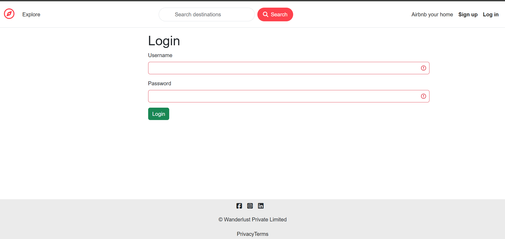
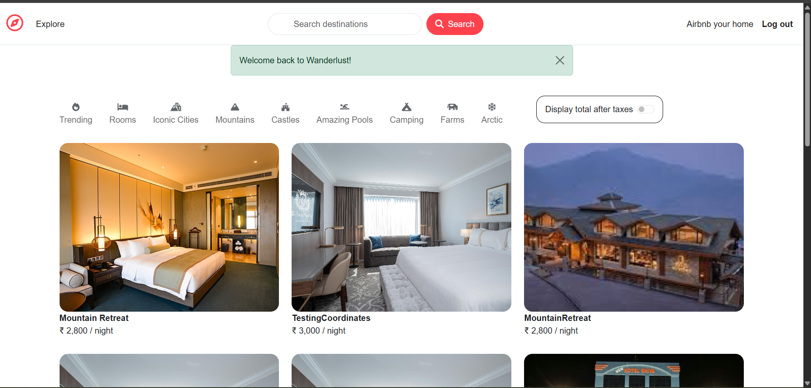
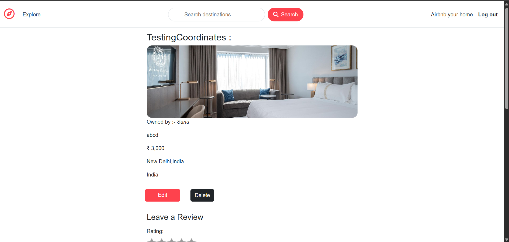
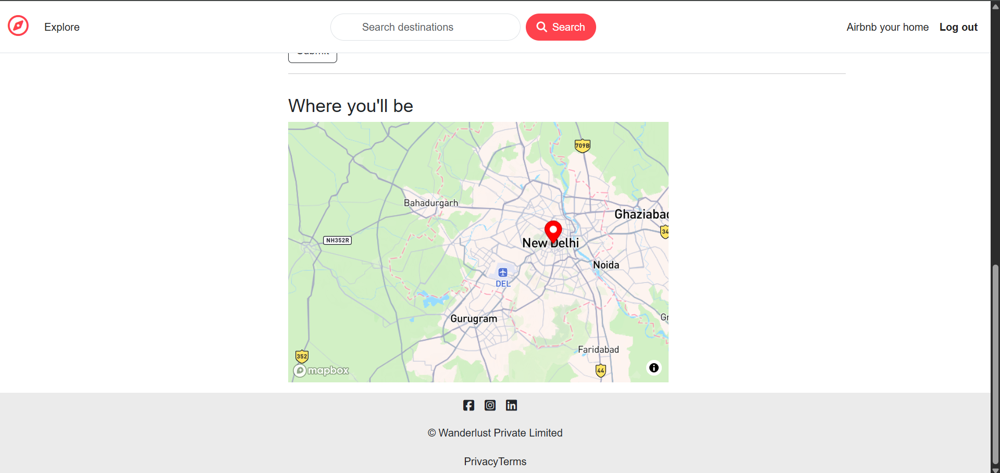

**Nearby Hotel Locator** is a web application that helps users search, view, and explore hotels near their location with prices displayed on an interactive Mapbox map. It is designed using the MVC architecture for clean code structure, ensuring scalability and maintainability.

🔗 **Live App**: [Click here](https://airbnb-1-yv3s.onrender.com/login)

---

## 🚀 Features

- 🔑 User Authentication with secure data management
- 🗺️ Interactive Mapbox integration for location-based hotel search
- 🏨 Dynamic hotel listings with real-time prices
- 🏗️ MVC architecture for organized codebase
- ☁️ Deployed on Render for live access

---

## ⚙️ Tech Stack

- **Backend**: Node.js, Express.js
- **Frontend**: EJS (Embedded JavaScript templates)
- **Database**: MongoDB Atlas
- **Maps API**: Mapbox API
- **Deployment**: Render

---

## 📂 Project Structure

```
majorproject/
│── controllers/        # Application logic
│── models/             # Database schemas (MongoDB)
│── routes/             # Route definitions
│── views/              # EJS templates
│── public/             # Static files (CSS, JS, Images)
│── screenshots/        # Project screenshots
│── app.js              # Main entry point
│── package.json
│── README.md
```

---

## 🛠️ Installation & Setup

Clone the repo and install dependencies:

```bash
# Clone the repo
git clone https://github.com/anuj23awasthi/Airbnb.git
cd Airbnb

# Install dependencies
npm install

# Add environment variables
# Create a .env file in the root directory and add:
# MONGO_URI=your_mongodb_connection_string
# MAPBOX_TOKEN=your_mapbox_api_key
# SESSION_SECRET=your_secret_key

# Run the app
npm start
👉 Visit http://localhost:5000
```

---

## 🌍 Live Demo
[Nearby Hotel Locator - Live](https://airbnb-1-yv3s.onrender.com/login)

---

## 📸 Screenshots

Login Page:


Hotel Listings Page:


Hotel Details Page:


Map Integration:


---

## 🤝 Contribution
Contributions are welcome!

1. Fork the repo
2. Create your feature branch (`git checkout -b feature-name`)
3. Commit changes (`git commit -m 'Add feature'`)
4. Push to branch (`git push origin feature-name`)
5. Open a Pull Request

---

## 📜 License
This project is licensed under the MIT License.
